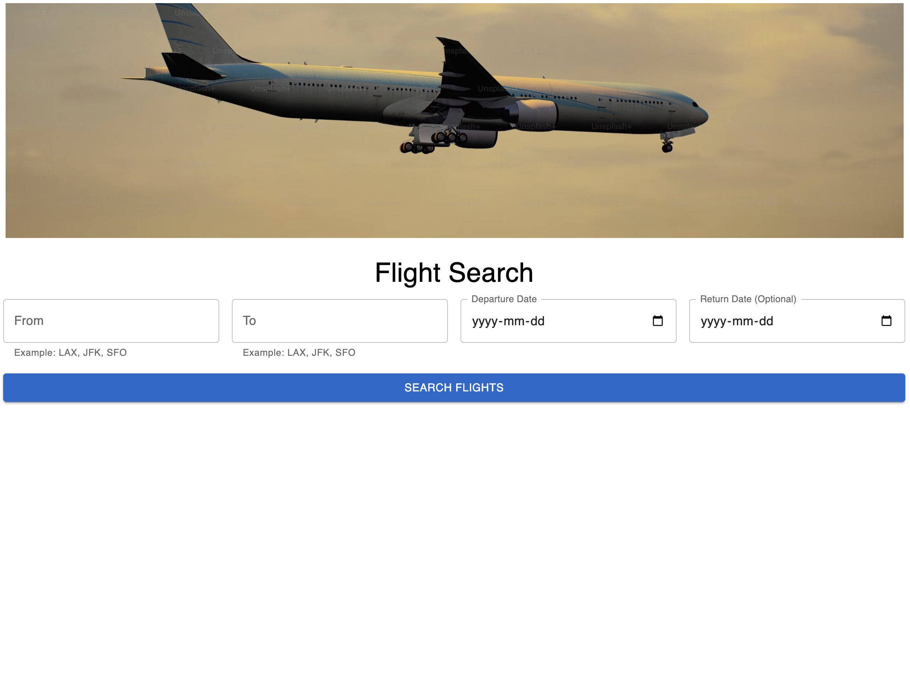
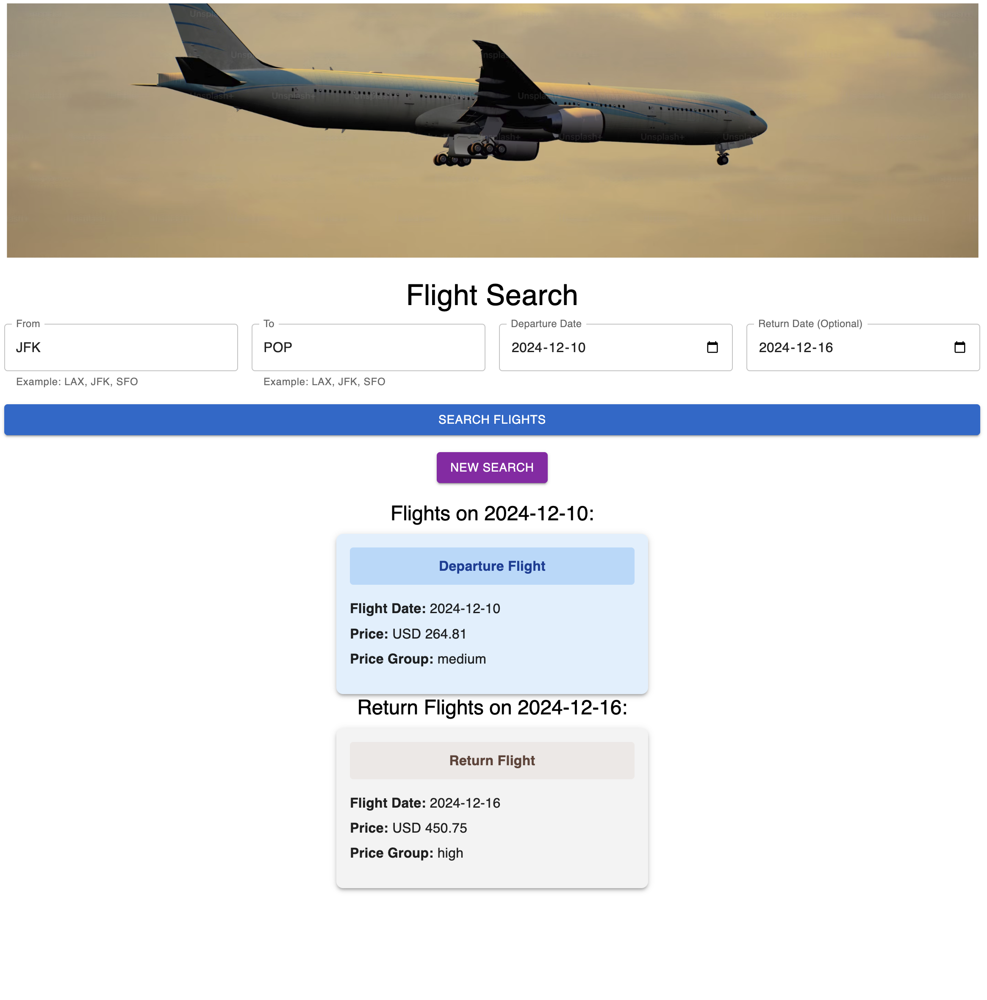
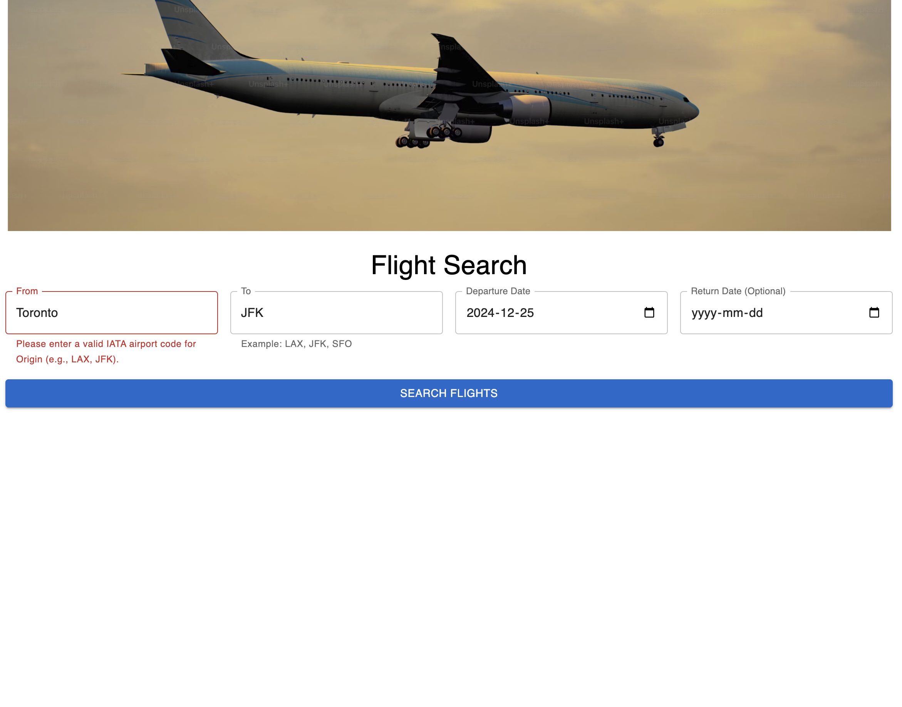

# Google Flights Clone - Flight Search Application

This is a responsive React application that replicates key features of **Google Flights**. It allows users to search for flights, filter results, and view departure and return flight options using the **Sky-Scrapper API**.

---
### ScreenShots




## Features

- **Search for Flights**: 
  - Enter departure and destination airport codes.
  - Select travel dates and search for available flights.
  
- **Optional Return Flights**: 
  - Allows searching for return flights by specifying a return date.
  
- **Error Handling**: 
  - Ensures valid input by prompting users to use airport codes (not city names).
  
- **New Search**: 
  - Allows resetting the form and search results for a fresh query.

---

## Technologies Used

- **React**: JavaScript library for building user interfaces.
- **Material-UI**: A popular React component library for styling and design.
- **Sky-Scrapper API**: API to fetch flight data.
- **React hooks (useState, useEffect)**: For managing state and lifecycle methods.
  
---

## Installation

Follow these steps to get your development environment set up:

### 1. Clone the repository

```bash
git clone https://github.com/KShilina/google-flights-clone

```
### 2. Navigate to the project folder
```
cd google-flights-clone

```
### 3. Install dependencies
```
npm install
```
This will install all the required dependencies listed in the package.json file for the project.

### 4. Set Up API Key:
* Sign up at RapidAPI and subscribe to the Sky-Scrapper API.
* Create a .env file in the project root and add your API key:

```
REACT_APP_SKYSCRAPPER_API_KEY=your-api-key-here
```
This will ensure your API key is available in the app when making requests.

### 5. Run the application
Once the dependencies are installed and the environment is set up, you can run the application locally in development mode with:

```
npm start
```
This will start the development server, and you can open the app by visiting http://localhost:3000 in your browser.

The app will automatically reload when you make changes to the code.


# Usage
## 1. Search for Flights:

* Enter the departure airport code (e.g., JFK) and destination airport code (e.g., LAX).
* Select a departure date using the date picker.
* Optionally, select a return date to see return flight options.

## 2. Error Handling:

* If the input is invalid (e.g., a city name instead of an airport code), an error message will prompt you to correct the input.
## 3. New Search:

* Click the "New Search" button to reset the form and results, and perform a new query.


# Key Dependencies
* React: Frontend library for building UI.
* Material-UI: Provides responsive, accessible, and visually appealing UI components.
* Axios: HTTP client for API requests.


# API Integration
* The app integrates with the Sky-Scrapper API from RapidAPI to fetch flight data.

# API Endpoints
* /flights/getPriceCalendar: Fetches flight data based on parameters like departure, destination, and travel dates.


# Future Enhancements
* Implement a map view for airport locations.
* Allow users to save favorite searches.
* Add support for multiple currencies.
* Integrate more robust error handling and validation.

# Acknowledgments
* RapidAPI for the Sky-Scrapper API.
* Material-UI for providing intuitive UI components.


